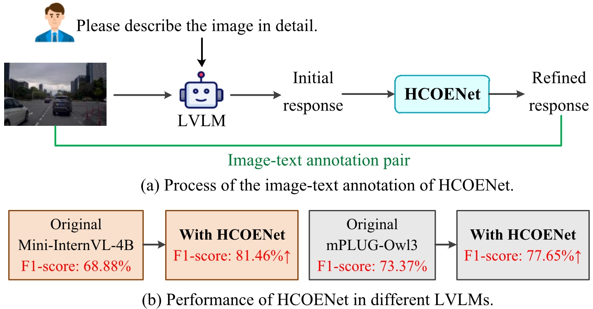
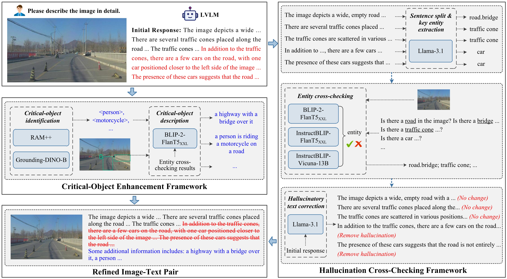
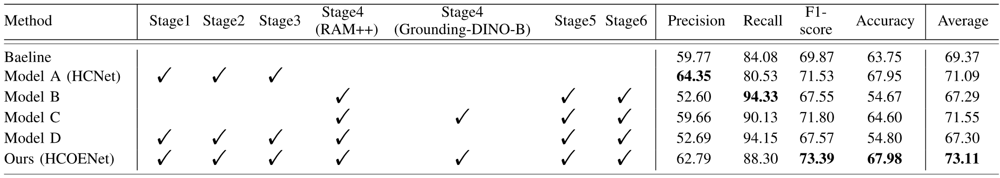
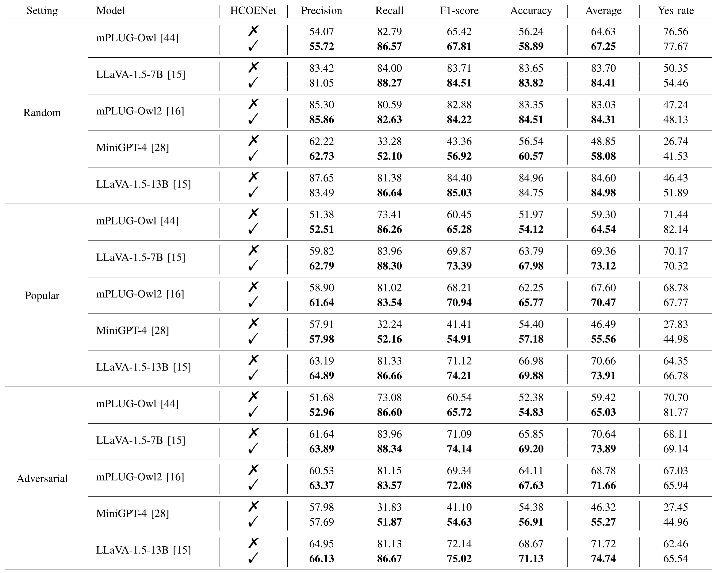
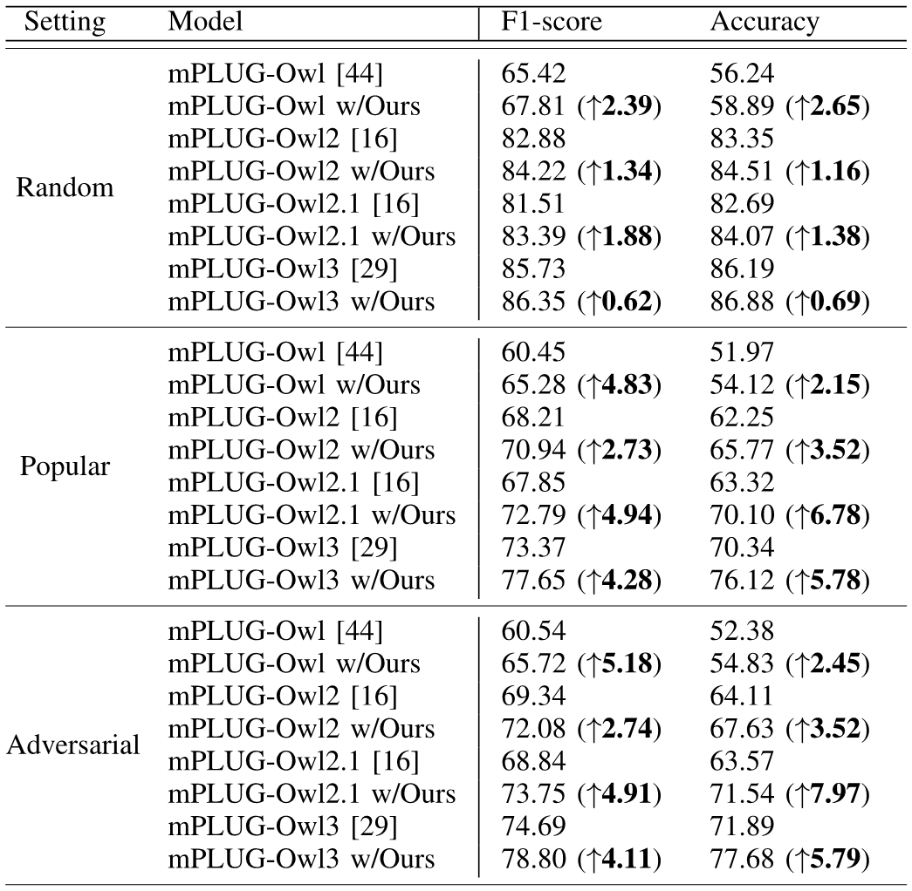
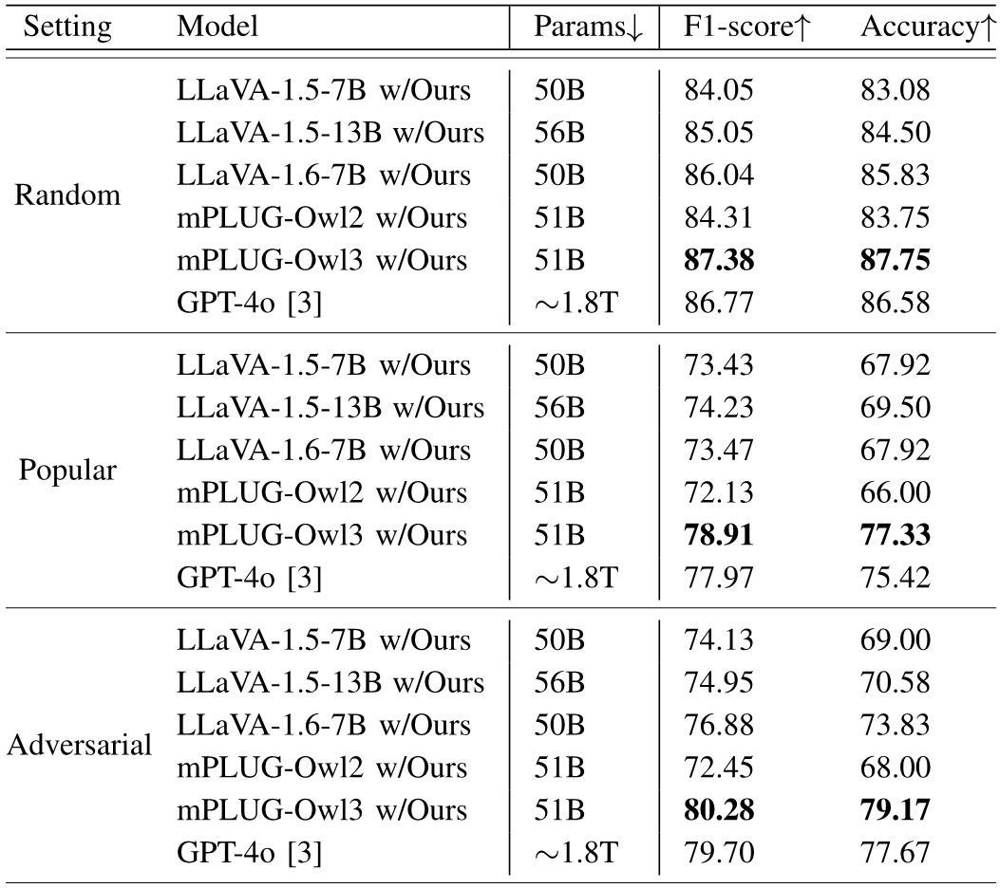
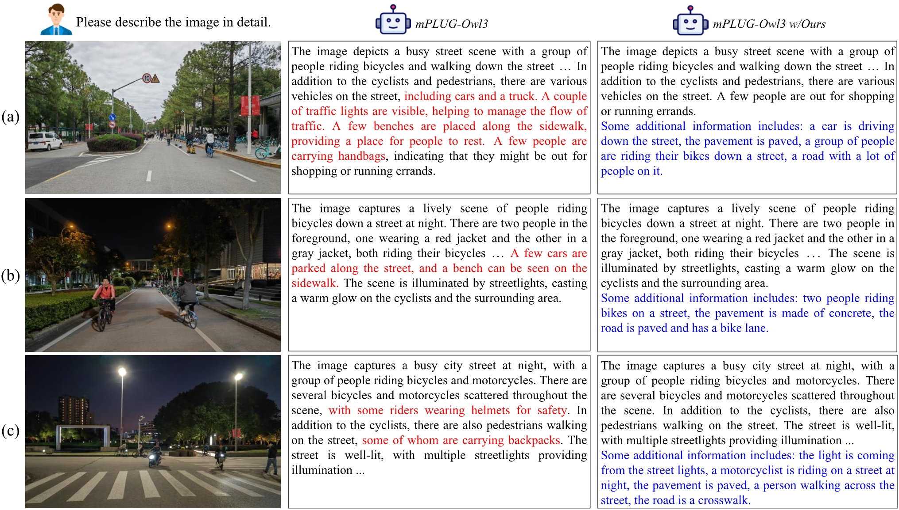

<div style="text-align: center;">
  <h1>Hallucination Elimination and Semantic Enhancement Framework for Vision-Language Models in Traffic Scenarios</h1>
</div>

<div style="text-align: center;">
  
</div>

> Large vision-language models (LVLMs) have demonstrated remarkable capabilities in multimodal understanding and generation tasks. However, these models occasionally generate hallucinatory texts, resulting in descriptions that seem reasonable but do not correspond to the image. This phenomenon can lead to wrong driving decisions of the autonomous driving system. To address this challenge, this paper proposes HCOENet, a plug-and-play chain-of-thought correction method designed to eliminate object hallucinations and generate enhanced descriptions for critical objects overlooked in the initial response. Specifically, HCOENet employs a cross-checking mechanism to filter entities and directly extracts critical objects from the given image, enriching the descriptive text. Experimental results on the POPE benchmark demonstrate that HCOENet improves the F1-score of the Mini-InternVL-4B and mPLUG-Owl3 models by 12.58% and 4.28%, respectively. Additionally, qualitative results using images collected in open campus scene further highlight the practical applicability of the proposed method. Compared with the GPT-4o model, HCOENet achieves comparable descriptive performance while significantly reducing costs. Finally, two novel semantic understanding datasets, CODA_desc and nuScenes_desc, are created for traffic scenarios to support future research. 

If you have any question, please feel free to email fanjq@tongji.edu.cn.

## :fire: News
- Read our paper [https://arxiv.org/abs/2412.07518]
- Video demo [https://github.com/fjq-tongji/HCOENet/releases/download/demo/Video.Demo.mp4]
- CODA_desc_dataset_texts_9263.json and nuScenes_desc.rar are the created datasets.  

## :book: Model


## :pill: Installation
1. LLaVA: https://github.com/haotian-liu/LLaVA
2. mPLUG-Owl: https://github.com/X-PLUG/mPLUG-Owl
3. MiniGPT-4: https://github.com/Vision-CAIR/MiniGPT-4
4. InternVL: https://github.com/OpenGVLab/InternVL
5. BLIP-2: https://huggingface.co/Salesforce/blip2-flan-t5-xxl
6. InstructBLIP: https://huggingface.co/Salesforce/instructblip-flan-t5-xxl
7. RAM: https://github.com/xinyu1205/recognize-anything
8. GroundingDINO: https://github.com/IDEA-Research/GroundingDINO

## :star: Inference
1. Download the traffic dataset from CODA website (https://coda-dataset.github.io);
2. Generate question-answer pair using POPE code
```
$ python POPE codes/CODA2022/CODA2022_pope_random.json
$ python POPE codes/CODA2022/CODA2022_pope_popular.json
$ python POPE codes/CODA2022/CODA2022_pope_adversarial.json
```
3. Generate initial response for each image using specific LVLM, such as LLaVA-1.5, mPLUG-Owl.
4. Generate refined response using HCOENet framework:  
```
$ python inference_split_sents.py
$ python inference_named_entity.py
$ python inference_blip2_3.py
$ python inference_instructblip_3.py
$ python inference_entity_update_3.py
$ python inference_groundingdino_4.py
$ python inference_groundingdino_words_update_4.py
$ python inference_groundingdino_write_captions_5.py
$ python inference_entity_captions_update_6.py
```    
5. Evaluate the model under POPE benchmark.
6. Generate more refined descriptions using nuScenes dataset.   

## :trophy: Experimental Results
### Ablation studies
Table 1. Ablation studies of the effectiveness of each stage in the HCOENet. Stage1 refers the sentence split and key entity extraction, stage2 refers the entity cross-checking, stage3 refers the hallucination correction, stage4 refers the critical-object identification, stage5 refers the object description, and stage6 refers integrating descriptions from two frameworks. (\%)   

### Quantitative results  
Table 2. Evaluation results of five LVLMs on the POPE benchmark under three negative sampling settings. (\%) 
  
Table 3. Comparison results between different mPLUG-Owl models on the POPE benchmark. (\%)   
  
Table 4. Comparison with the GPT-4o model on the POPE benchmark. B denotes billion and T denotes trillion. (\%)  
  
### Qualitative results  
  

## :sunflower: Acknowledgement
This repository benefits from the following codes. Thanks for their awesome works.
- [LLaVA](https://github.com/haotian-liu/LLaVA)
- [mPLUG-Owl](https://github.com/X-PLUG/mPLUG-Owl)
- [MiniGPT-4](https://github.com/Vision-CAIR/MiniGPT-4)
- [InternVL](https://github.com/OpenGVLab/InternVL)
- [BLIP-2](https://huggingface.co/Salesforce/blip2-flan-t5-xxl)
- [InstructBLIP](https://huggingface.co/Salesforce/instructblip-flan-t5-xxl)(https://huggingface.co/Salesforce/instructblip-vicuna-13b)
- [Woodpecker](https://github.com/BradyFU/Woodpecker)
- [POPE](https://github.com/AoiDragon/POPE)
- [RAM](https://github.com/xinyu1205/recognize-anything)
- [GroundingDINO](https://github.com/IDEA-Research/GroundingDINO)

## :scroll: Citation
@article{fan2024hallucination,  
  title={Hallucination Elimination and Semantic Enhancement Framework for Vision-Language Models in Traffic Scenarios},  
  author={Fan, Jiaqi and Wu, Jianhua and Chu, Hongqing and Ge, Quanbo and Gao, Bingzhao},  
  journal={arXiv preprint arXiv:2412.07518},  
  year={2024}  
}

